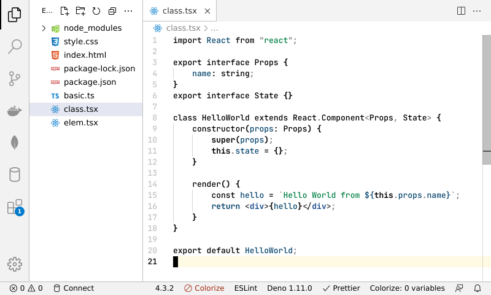
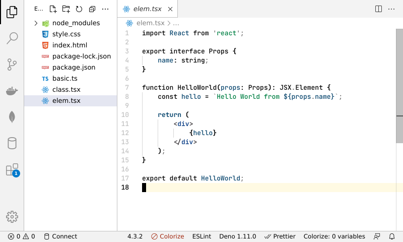
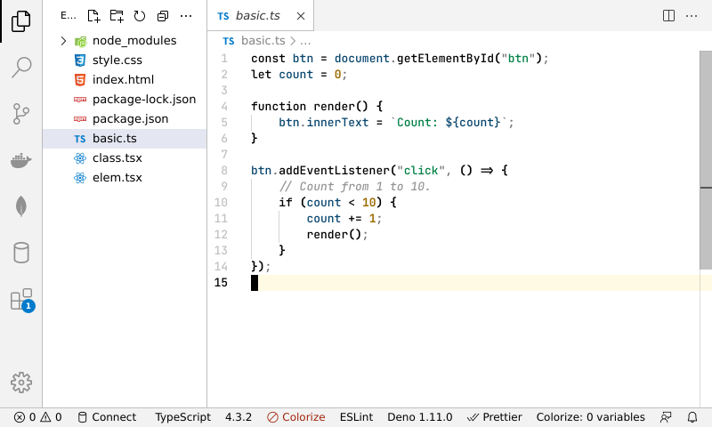
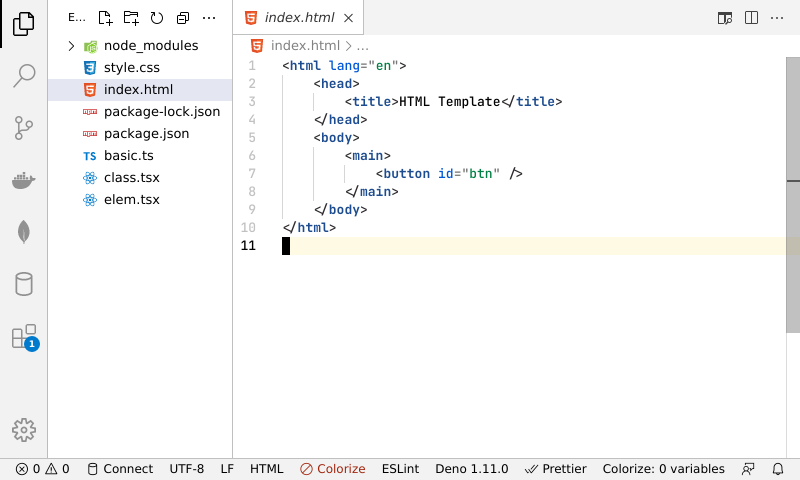
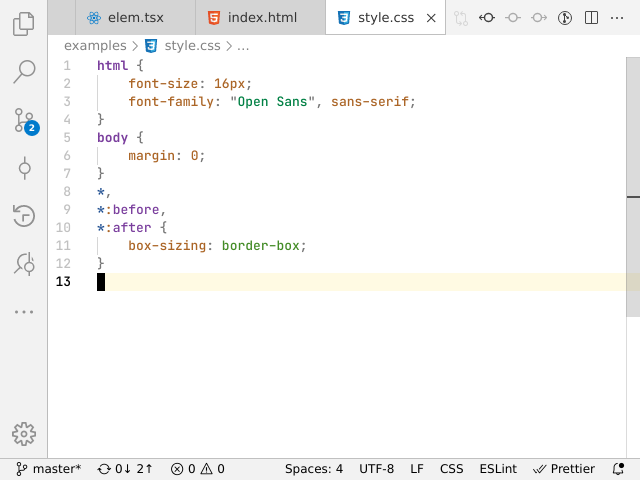

# Simple light theme

<!-- https://github.com/pawelgrzybek/gatito-theme -->

Inspired by [vscode-ideal-theme](https://github.com/karsany/vscode-ideal-theme)

## Goal

Don't expect any fancy colors.

More colors equals more distraction, we don't want to waste cognitive capacity
on that. The goal of this theme is to have the minimum meaningful colors.

## Languages specific tweaks

- TypeScript
- JavaScript
- JSX, TSX
- Bash

Others comming soon...

## Preview

- Font used [JetBrains Mono](https://www.jetbrains.com/lp/mono/)
- Icons used [vscode-icons](https://github.com/vscode-icons/vscode-icons)

