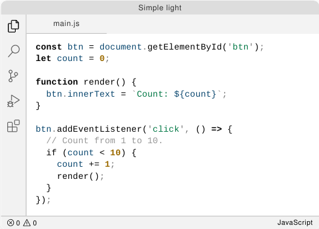
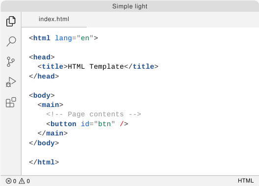
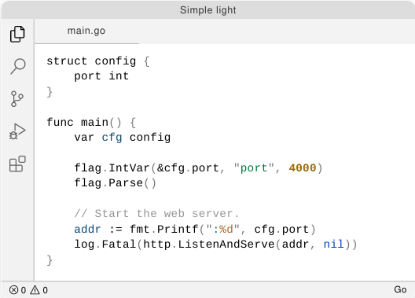
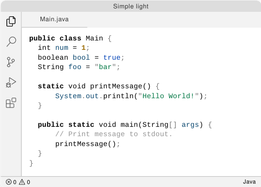
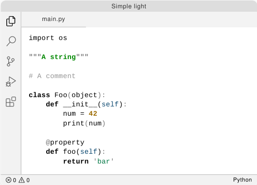
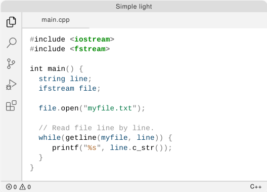

# Simple light theme

Inspired by [IDEA like light Theme][inspired-by] and [GitLabs][gitlab-theme]
light highlighting syntax.

## Goal

Don't expect any fancy colors.

More colors equals more distraction, we don't want to waste cognitive capacity
on that. The goal of this theme is to have the minimum meaningful colors.

## Supported languages

- TypeScript
- JavaScript
- HTML
- Java
- Go
- C++
- Bash
- Markdown
- CSS, SCSS, Less

Others comming soon...

## Preview

- Font used [JetBrains Mono](https://www.jetbrains.com/lp/mono/)
- Icons used [vscode-icons](https://github.com/vscode-icons/vscode-icons)

**JavaScript**

**HTML**

**CSS**

**Go**

**Java**

**Python**

**C++**

## Contributors

Thank for feedback:

- @MarcelGeo
- @dderevjanik

## Related projects

– [vscode-ideal-theme][inspired-by] – IDEA like light Theme

[inspired-by]: https://github.com/karsany/vscode-ideal-theme
[gitlab-theme]: https://docs.gitlab.com/ee/user/profile/preferences.html#syntax-highlighting-theme
