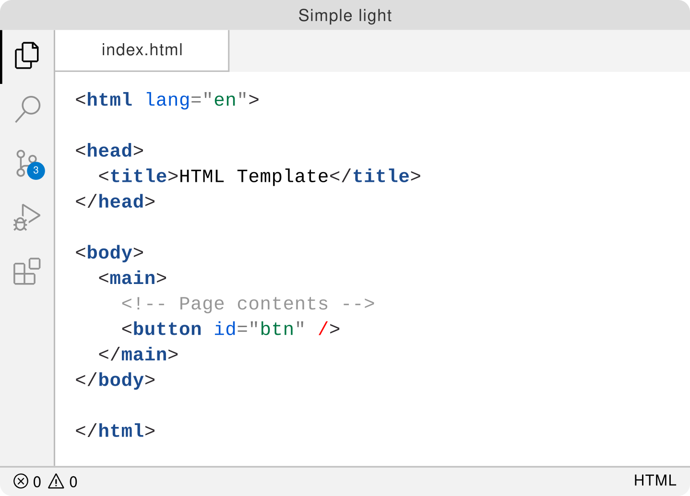
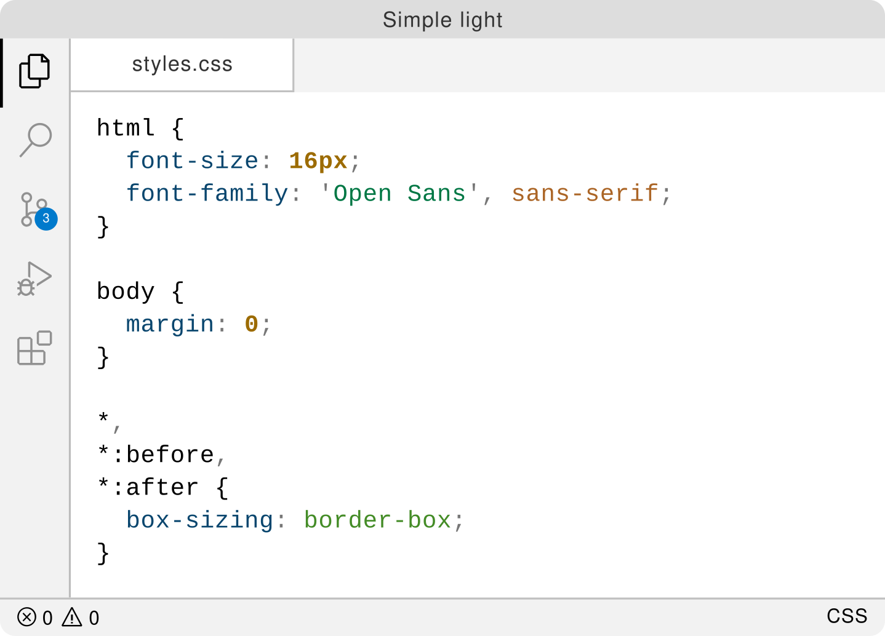

# 💡 Simple Light Theme

Inspired by

- [IDEA like light Theme][inspired-by] syntax
- [GitLab's][gitlab-theme] syntax
- [VSCode][vscode-light-modern] light theme

## Goal

Don't expect any fancy colors.

More colors equal more distraction; we don't want to waste cognitive capacity
on that. The goal of this theme is to have the minimum meaningful colors.

## Preview

| Language       | Preview                                                         |
| -------------- | --------------------------------------------------------------- |
| **JavaScript** |  |
| **Go**         |                  |
| **Java**       |            |
| **HTML**       |            |
| **CSS**        |               |
| **Python**     |          |
| **C++**        |               |

## Related

- [vscode-ideal-theme][inspired-by] – IDEA like light Theme
- [gitlab-theme][gitlab-theme] – GitLab's syntax highlighting theme
- [vscode-light-modern][vscode-light-modern] – VSCode's light modern theme

[inspired-by]: https://github.com/karsany/vscode-ideal-theme
[gitlab-theme]: https://docs.gitlab.com/ee/user/profile/preferences.html#syntax-highlighting-theme
[vscode-light-modern]: https://github.com/microsoft/vscode/blob/ce50bd4876af457f64d83cfd956bc916535285f4/extensions/theme-defaults/themes/light_modern.json
