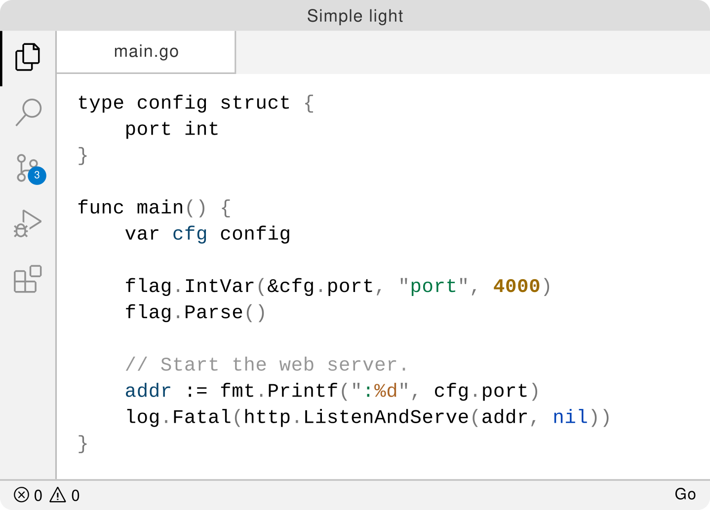
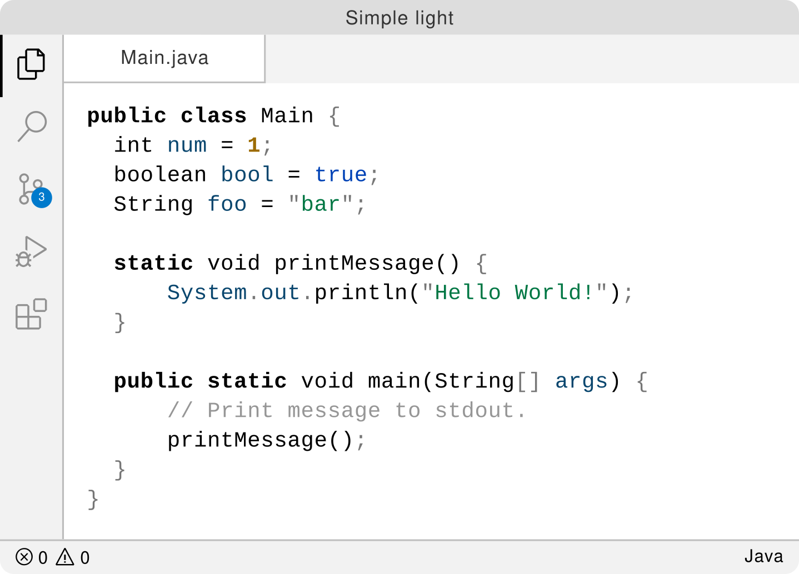

# Simple Light Theme

Inspired by [IDEA like light Theme][inspired-by] and [GitLab's][gitlab-theme]
light highlighting syntax.

## Goal

Don't expect any fancy colors.

More colors equal more distraction; we don't want to waste cognitive capacity
on that. The goal of this theme is to have the minimum meaningful colors.

## Supported Languages

- TypeScript
- JavaScript
- HTML
- Java
- Go
- C++
- Bash
- Markdown
- CSS, SCSS, Less

Others coming soon...

## Preview

## Related

- [vscode-ideal-theme][inspired-by] – IDEA like light Theme

[inspired-by]: https://github.com/karsany/vscode-ideal-theme
[gitlab-theme]: https://docs.gitlab.com/ee/user/profile/preferences.html#syntax-highlighting-theme
